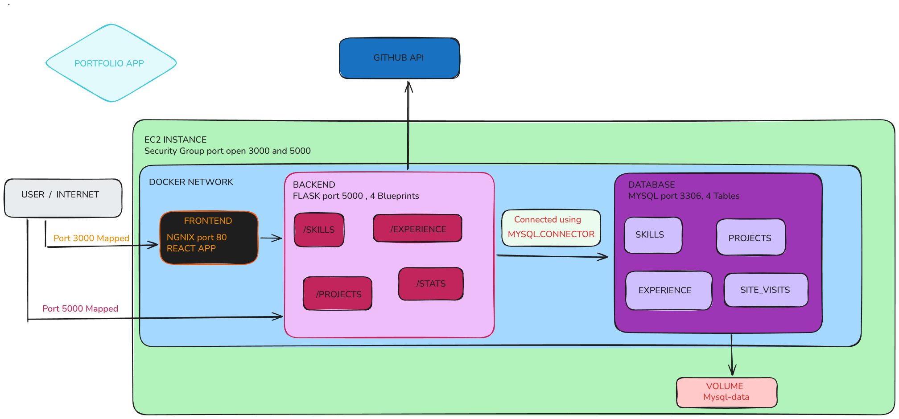

<h1 align="center">Portfolio App</h1>

A three-tier personal portfolio application - React frontend, Flask (Python) backend, and MySQL database - deployed with Docker Compose. Automatically pulls project data from GitHub and lets you manage skills/experience via JSON files.


---

### Tech Stack

**Frontend:** React, axios, nginx (production build server + reverse proxy)
**Backend:** Python, Flask, Flask-CORS, mysql-connector-python
**Database:** MySQL 8.0
**Infra:** Docker, Docker Compose

### Architecture

---




```
Browser
   │
   ▼
Frontend (React + nginx, port 3000 → 80)
   │  nginx reverse-proxies /api/* internally
   ▼
Backend (Flask, port 5000, internal only)
   │
   ▼
Database (MySQL, port 3306, internal only)
   │
   ▼
Docker volume (mysql-data) — persists on host disk
```
---

### Environment Variables

**Project root .env (used by docker-compose.yml):**

```
DB_NAME=portfolio
DB_PASSWORD=your_mysql_password
BACKEND_PORT=5000
FRONTEND_PORT=3000

```

**backend/.env:**

```
DB_HOST=my-mysql
DB_USER=root
DB_PASSWORD=your_mysql_password
DB_NAME=portfolio
PORT=5000
GITHUB_USERNAME=your_github_username
GITHUB_TOKEN=your_optional_personal_access_token
```
---

### Prerequists

```
Docker
Docker Compose
security group port 5000 and 3000 open if running on a server
```
---

### Running Locally

1. Clone and configure

```
git clone https://github.com/rohit5126/portfolio.git
cd portfolio
# create .env and backend/.env as shown above
```

2. Add your data

```
Edit backend/data/skills.json and backend/data/experience.json with your real skills and work history.
```

3. Build your own docker image

```
cd backend
docker build -t <name> .

cd frontend
docker build -t <name> .
```

4. Update image in docker-compose.yml

5. Run Everything

```
docker compose up -d
```

5. Open the app

http://localhost:3000

---

### Refreshing Data

* GitHub repos: re-run import_github.py anytime - it upserts by github_url, safe to repeat.

* Skills/experience: edit the JSON files, then re-run import_json_data.py - it replaces the tables' contents each time.

### Image Size

**Reduced Image size more than 50%.**

current image size - 


Previous image size -


**reduced image size using multistage docker file with minimal base image and minimal number of layers.**

---


